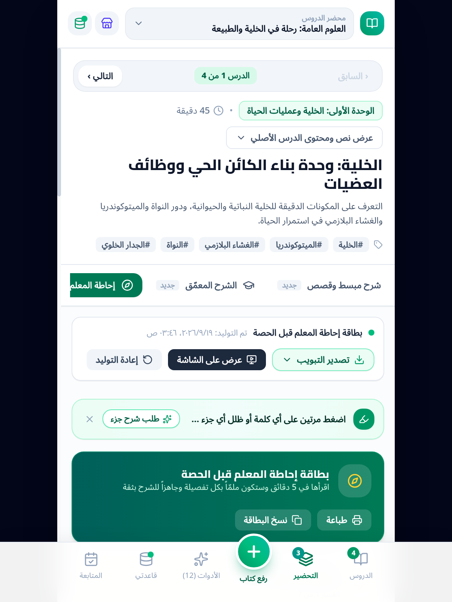
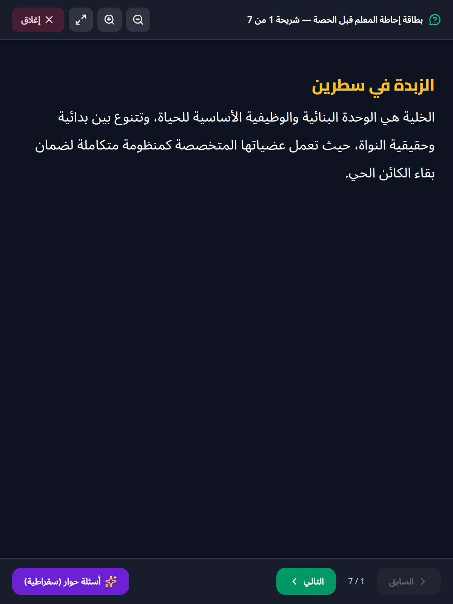
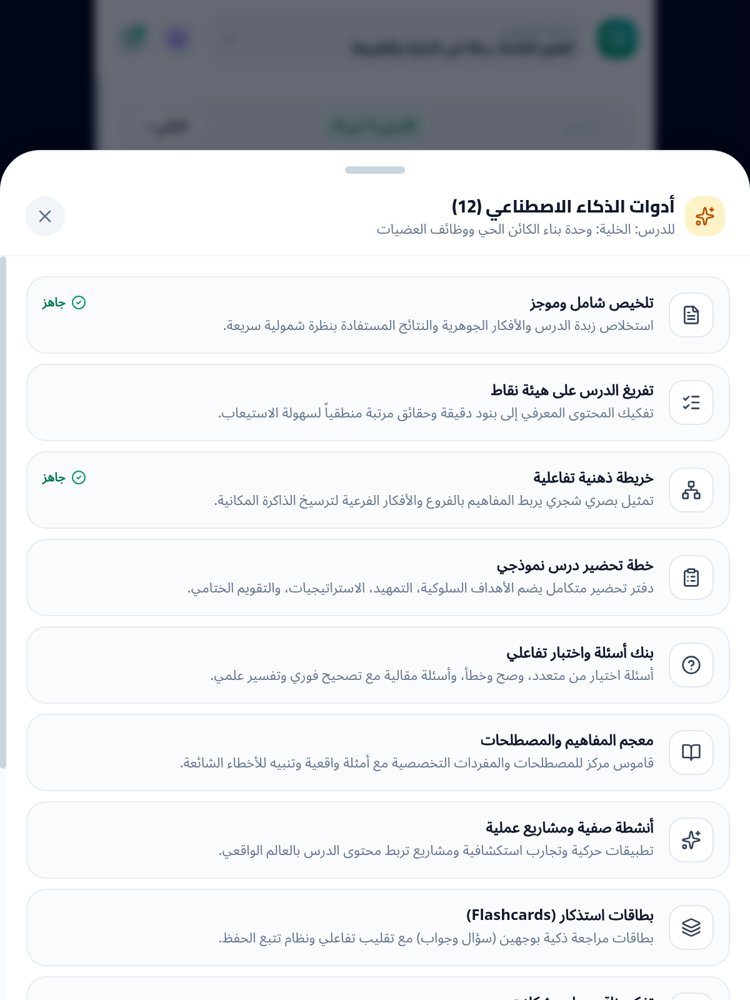
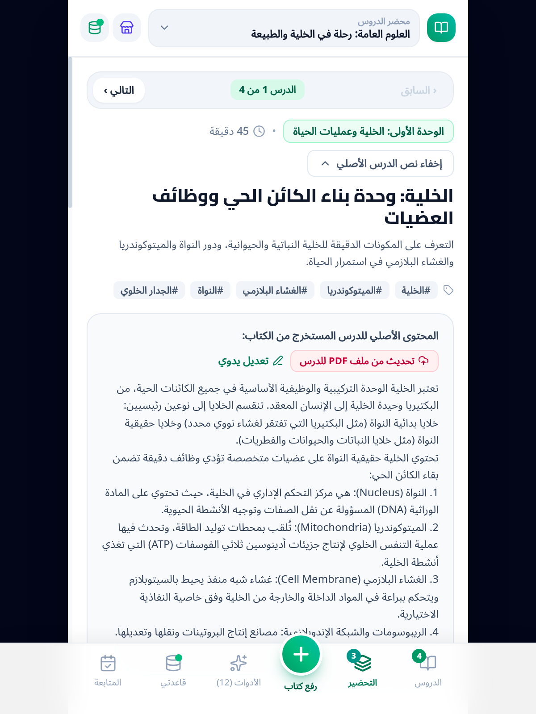

<div align="center">

# محضر الدروس | Mahdara Al-Durus

### تطبيق المعلم الذكي — حوّل كتبك ومقرراتك إلى وحدات ودروس، وكل بياناتك محفوظة محلياً على جهازك

**[الموقع الرسمي](https://mohamedewiasabd.github.io/mahdara-al-durus/)** · **[تنزيل أحدث إصدار](https://github.com/mohamedewiasabd/mahdara-al-durus/releases/latest)** · **[app-ads.txt](https://mohamedewiasabd.github.io/mahdara-al-durus/app-ads.txt)**


</div>

---

## 🌐 الموقع الرسمي

تطبيقٍ يعمل على كل المنصات، وله موقع رسمي على **[GitHub Pages](https://mohamedewiasabd.github.io/mahdara-al-durus/)** يتضمن:

- واجهة تعرّفية بالتطبيق ومميزاته.
- **روابط التنزيل المباشرة لجميع المنصات**.
- دليل التثبيت حسب توزيعة لينكس.
- ملف **`app-ads.txt`** الخاص بإعلانات AdMob (الرابط: <https://mohamedewiasabd.github.io/mahdara-al-durus/app-ads.txt>).

> النسخة العاملة بالكامل (مع الذكاء الاصطناعي في المتصفح) تُشغَّل عبر الخادم ببيئتك الخاصة:
> ```bash
> PORT=3000 GEMINI_API_KEY=... node dist/server.cjs
> ```

## 📱 تحميل التطبيق

### Android
- **APK النهائي (إعلانات حقيقية):** `https://github.com/mohamedewiasabd/mahdara-al-durus/releases/download/v1.1.0/mahdara-al-durus-release-v1.1.0.apk`
- **نسخة بلاي ستور (AAB):** `https://github.com/mohamedewiasabd/mahdara-al-durus/releases/download/v1.1.0/mahdara-al-durus-release-v1.1.0.aab`
- **نسخة تطوير (إعلانات اختبار):** `https://github.com/mohamedewiasabd/mahdara-al-durus/releases/download/v1.1.0/mahdara-al-durus-debug.apk`

### Windows
- **مثبّت:** `https://github.com/mohamedewiasabd/mahdara-al-durus/releases/download/v1.1.0/mahdara-al-durus_1.1.0_x64-setup.exe`
- **MSI:** `https://github.com/mohamedewiasabd/mahdara-al-durus/releases/download/v1.1.0/mahdara-al-durus_1.1.0_x64_en-US.msi`

### Linux — حسب توزيعتك

| التوزيعة | الطريقة | الأمر |
| --- | --- | --- |
| Ubuntu / Debian | `.deb` من Releases | `curl -L -o m.deb https://github.com/mohamedewiasabd/mahdara-al-durus/releases/download/v1.1.0/mahdara-al-durus_1.1.0_amd64.deb && sudo apt install ./m.deb` |
| أي توزيعة | `.AppImage` | `chmod +x mahdara-al-durus_1.1.0_amd64.AppImage && ./mahdara-al-durus_1.1.0_amd64.AppImage` |
| Arch (AUR) | `PKGBUILD` | `yay -S mahdara-al-durus` ⏳ قيد التقديم |
| openSUSE / Fedora (OBS) | `.rpm` من `packaging/linux/opensuse/` | ⏳ قيد التقديم |
| Flathub | Flatpak | `flatpak install flathub org.mahdara.durus` ⏳ قيد المراجعة |
| Ubuntu Snap | Snap Store | `sudo snap install mahdara-al-durus` ⏳ قيد التقديم |

⏳ = ملفات الحزم جاهزة في `packaging/` وقيد التقديم على المستودعات.

### macOS
- **Apple Silicon:** `https://github.com/mohamedewiasabd/mahdara-al-durus/releases/download/v1.1.0/mahdara-al-durus_1.1.0_aarch64.dmg`
- **Intel:** `https://github.com/mohamedewiasabd/mahdara-al-durus/releases/download/v1.1.0/mahdara-al-durus_1.1.0_x64.dmg`

### iPhone / iPad
- التطبيق جاهز (بناء CI نجح)؛ الإتاحة على App Store بعد التوقيع والتقديم.

## ✨ المميزات

- **١٢ أداة ذكاء اصطناعي:** تحضير الدروس، التلخيص، الخرائط الذهنية، بنك الأسئلة والاختبارات، الأنشطة الصفية، متابعة الطلاب، تقسيم الكتب لوحدات ودروس، العروض التقديمية، وغيرها.
- **🍃 بلا إنترنت للبيانات:** كل المحتوى محفوظ محلياً (IndexedDB) — خصوصيتك أولاً.
- **☁️ نسخ احتياطي:** Google Drive بحساب المستخدم.
- **📣 عرض مباشر داخل الحصة** ووضع حضور الطلاب.
- **منصات متعددة من كود واحد:** Web / Android / Windows / Linux / macOS / iOS عبر React 19 + Capacitor 8 + Tauri 2.

## 🖼️ لقطات الشاشة

<p align="center">




</p>

## 🛠️ التقنيات والبناء

- **الواجهة:** React 19 · Vite 6 · TypeScript · Tailwind CSS 4
- **الجوال:** Capacitor 8 (Android + iOS)
- **سطح المكتب:** Tauri 2 (Windows / Linux / macOS)
- **الذكاء الاصطناعي:** Gemini API مباشرة داخل التطبيق (Android/iOS/سطح المكتب) وعبر خادم Express في الويب
- **الإعلانات:** AdMob على Android (معرّفات حقيقية في النسخ النهائية واختبارية في Debug تلقائياً عبر `BuildConfig.DEBUG`)

```bash
# التحقق والبناء
export PATH="$HOME/.nvm/versions/node/v22.22.0/bin:$PATH"
npm install
npm run lint        # فحص TypeScript
npm run build       # بناء الويب + خادم Express
npx cap sync android && cd android && ./gradlew assembleRelease

# سطح المكتب
npm run desktop:build            # أهداف النظام الحالي
npm run desktop:build:linux      # deb + AppImage

# الإصدار الكامل (تصعيد + بناء كل النسخ + رفع + جلب نواتج CI)
npm run release
```

وثيقة البروتوكول الكامل (تصعيد الإصدار، التوقيع، الأمان، الرفع) في **[AGENTS.md](AGENTS.md)** و`script/release-all.sh`.

## 🔒 الأمان والخصوصية

- بيانات المستخدم لا تُرفع إلا لنسخته الاحتياطية عبر Google Drive بإذنه.
- مفتاح Gemini يُضمَّن وقت البناء ولا يُرفع إلى المستودع.
- إعلانات AdMob وفق سياسات Google؛ ملف `app-ads.txt` منشور في جذر الموقع.

## 📄 الترخيص والمساهمة

كود مفتوح المصدر بإشراف mohamedewiasabd. للاقتراحات والأخطاء استخدم [GitHub Issues](https://github.com/mohamedewiasabd/mahdara-al-durus/issues).

<div align="center">

**[الموقع الرسمي](https://mohamedewiasabd.github.io/mahdara-al-durus/)** · **[تحديد إصدار](https://github.com/mohamedewiasabd/mahdara-al-durus/releases/latest)**

</div>